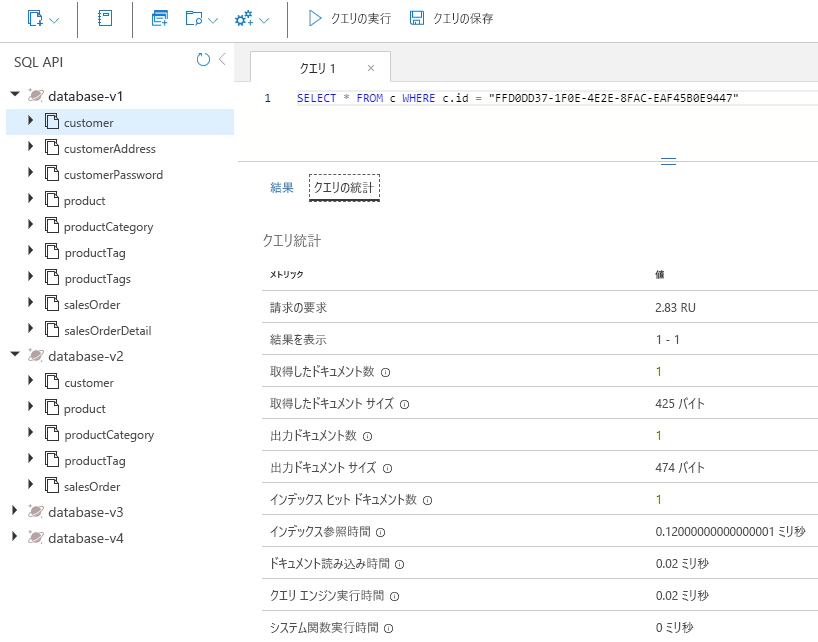
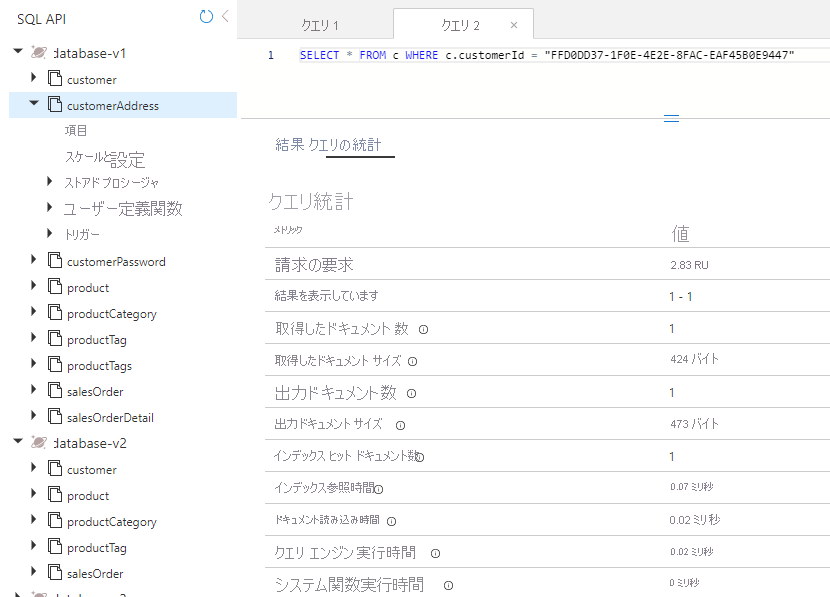
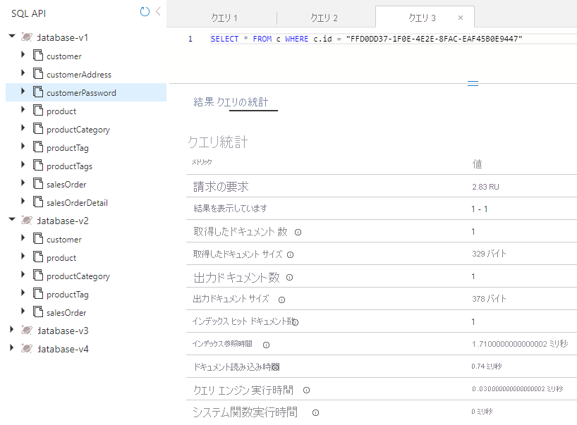
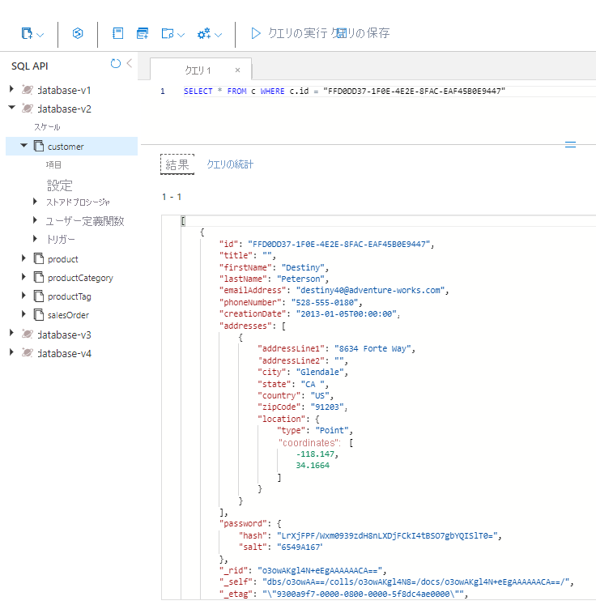

---
lab:
  title: 個別のコンテナーおよび埋め込みコンテナー内にあるエンティティのパフォーマンスを測定する
  module: Module 8 - Implement a data modeling and partitioning strategy for Azure Cosmos DB SQL API
ms.openlocfilehash: b3f7be3d3f7674fc19b2823de50d013e3bd4b04d
ms.sourcegitcommit: b90234424e5cfa18d9873dac71fcd636c8ff1bef
ms.translationtype: HT
ms.contentlocale: ja-JP
ms.lasthandoff: 01/12/2022
ms.locfileid: "138024965"
---
# <a name="measure-performance-of-entities-in-separate-and-embeded-containers"></a>個別のコンテナーおよび埋め込みコンテナー内にあるエンティティのパフォーマンスを測定する

この演習では、エンティティを個別のコンテナーとしてモデリングした場合と、エンティティを 1 つのドキュメントに埋め込む NoSQL データベースのモデリングを行った場合について、顧客エンティティの違いを測定します。

## <a name="prepare-your-development-environment"></a>開発環境を準備する

このラボで作業している環境に **DP-420** のラボ コードのリポジトリをまだ複製していない場合は、次の手順に従って複製します。 それ以外の場合は、以前に複製されたフォルダーを **Visual Studio Code** で開きます。

1. **Visual Studio Code** を起動します。

    > &#128221; Visual Studio Code インターフェイスの詳細をまだ十分理解していない場合は、「[Visual Studio Code の入門ガイド][code.visualstudio.com/docs/getstarted]」を参照してください。

1. コマンド パレットを開き、**Git: Clone** を実行して、選択したローカル フォルダーに ``https://github.com/microsoftlearning/dp-420-cosmos-db-dev`` GitHub リポジトリを複製します。

    > &#128161; **CTRL + SHIFT + P** キーボード ショートカットを使用してコマンド パレットを開くことができます。

1. リポジトリが複製されたら、**Visual Studio Code** で選択したローカル フォルダーを開きます。

1. **Visual Studio Code** の **[エクスプローラー]** ウィンドウで、**16-measure-performance** フォルダーを参照します。

1. **16-measure-performance** フォルダーのコンテキスト メニューを開き、 **[統合ターミナルで開く]** を選択して新しいターミナル インスタンスを開きます。

1. ターミナルが **Windows Powershell** ターミナルとして開く場合は、新しい **Git Bash** ターミナルを開きます。

    > &#128161; **Git Bash** ターミナルを開くには、ターミナル メニューの右側で、 **+** 記号の横にあるプルダウンをクリックし、*Git Bash* を選択します。

1. **Git Bash ターミナル** で、次のコマンドを実行します。 コマンドを実行すると、ブラウザー ウィンドウが開き、指定されたラボ資格情報を使用する Azure portal に接続し、新しい Azure Cosmos DB アカウントを作成するスクリプトを実行した後、データベースにデータを入力して演習を完了するために使用するアプリをビルドして起動します。 *スクリプトで Azure アカウントに提供された資格情報が求められると、ビルドが完了するまでに 15 〜 20 分かかることがあるため、コーヒーやお茶を飲むのに適した時間かもしれません。*

    ```
    az login
    cd 16-measure-performance
    bash init.sh
    dotnet add package Microsoft.Azure.Cosmos --version 3.22.1
    dotnet build
    dotnet run --load-data

    ```

1. 統合ターミナルを閉じます。

## <a name="measure-performance-of-entities-in-separate-containers"></a>個別のコンテナー内にあるエンティティのパフォーマンスを測定する

Database-v1 では、データは個別のコンテナーに格納されます。 そのデータベースで、顧客、顧客住所、顧客パスワードを取得するクエリを実行します。 それぞれのクエリの要求料金を確認します。

### <a name="query-for-customer-entity"></a>顧客エンティティのクエリ

Database-v1 で、顧客エンティティを取得するクエリを実行し、要求料金を確認します。

1. 新しい Web ブラウザー ウィンドウまたはタブで、Azure portal (``portal.azure.com``) に移動します。

1. ご利用のサブスクリプションに関連付けられている Microsoft 資格情報を使用して、ポータルにサインインします。

1. Azure portal のメニューまたは **[ホーム]** ページで、**[Azure Cosmos DB]** を選択します。
1. 名前が **cosmicworks** で始まる Azure Cosmos DB アカウントを選択します。
1. 左側で **[データ エクスプローラー]** を選択します。
1. **[Database-v1]** を展開します。
1. **Customer** コンテナーを選択します。
1. 画面の上部にある **[新しい SQL クエリ]** を選択します。
1. 次の SQL テキストをコピーして貼り付けてから、**[クエリの実行]** を選択します。

    ```
    SELECT * FROM c WHERE c.id = "FFD0DD37-1F0E-4E2E-8FAC-EAF45B0E9447"
   ```

1. **[Query Stats]\(クエリ統計情報\)** タブを選択し、2.83 の要求料金を確認します。

    

### <a name="query-for-customer-address"></a>顧客住所のクエリ

顧客住所エンティティを取得するクエリを実行し、要求料金を確認します。

1. **CustomerAddress** コンテナーを選択します。
1. 画面の上部にある **[新しい SQL クエリ]** を選択します。
1. 次の SQL テキストをコピーして貼り付けてから、**[クエリの実行]** を選択します。

    ```
    SELECT * FROM c WHERE c.customerId = "FFD0DD37-1F0E-4E2E-8FAC-EAF45B0E9447"
   ```

1. **[Query Stats]\(クエリ統計情報\)** タブを選択し、2.83 の要求料金を確認します。

    

### <a name="query-for-customer-password"></a>顧客パスワードのクエリ

顧客パスワード エンティティを取得するクエリを実行し、要求料金を確認します。

1. **CustomerPassword** コンテナーを選択します。
1. 画面の上部にある **[新しい SQL クエリ]** を選択します。
1. 次の SQL テキストをコピーして貼り付けてから、**[クエリの実行]** を選択します。

    ```
    SELECT * FROM c WHERE c.id = "FFD0DD37-1F0E-4E2E-8FAC-EAF45B0E9447"
   ```

1. **[Query Stats]\(クエリ統計情報\)** タブを選択し、2.83 の要求料金を確認します。

    

### <a name="add-up-the-request-charges"></a>要求料金を追加する

すべてのクエリを実行したので、それらにかかった要求ユニットのコストをすべて加算しましょう。

|**クエリ**|**RU/s コスト**|
|---------|---------|
|顧客|2.83|
|顧客住所|2.83|
|顧客パスワード|2.83|
|**合計 RU/s**|**8.49**|

## <a name="measure-performance-of-embedded-entities"></a>埋め込みエンティティのパフォーマンスを測定する

今度は、エンティティを 1 つのドキュメントに埋め込んだ状態で、同じ情報のクエリを実行します。

1. **Database-v2** データベースを選択します。
1. **Customer** コンテナーを選択します。
1. 次のクエリを実行します。

    ```
    SELECT * FROM c WHERE c.id = "FFD0DD37-1F0E-4E2E-8FAC-EAF45B0E9447"
   ```

1. 返されるデータは、顧客、住所、パスワード データの階層になっていることを確認します。

    

1. **[Query Stats]\(クエリの統計情報\)** を選択します。先ほど実行した 3 つのクエリの 8.49 RU/s に対し、要求料金が 2.83 であることを確認します。

## <a name="compare-the-performance-of-the-two-models"></a>2 つのモデルのパフォーマンスを比較する

実行した各クエリの RU/s を比較すると、顧客エンティティが 1 つのドキュメント内にある場合の最後のクエリは、3 つのクエリを個別に実行した場合の合計コストよりもはるかに低コストであることがわかります。 このデータが返されるまでの待機時間が短いのは、データが 1 回の操作で返されるからです。

1 つの項目を検索していて、データのパーティション キーと ID がわかっている場合、Azure Cosmos DB SDK の `ReadItemAsync()` を呼び出すことで、"*ポイント読み取り*" を介してこのデータを取得できます。 ポイント読み取りはクエリよりもさらに高速です。 同じ顧客データの場合、コストはわずか 1 RU/s と 3 倍近く改善されます。

[code.visualstudio.com/docs/getstarted]: https://code.visualstudio.com/docs/getstarted/tips-and-tricks
