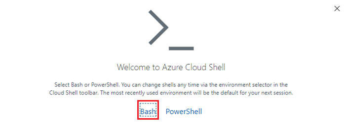
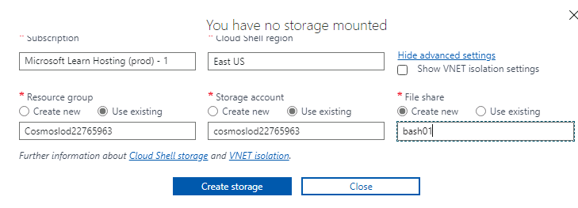

---
lab:
  title: 個別のコンテナーおよび埋め込みコンテナー内にあるエンティティのパフォーマンスを測定する
  module: Module 8 - Implement a data modeling and partitioning strategy for Azure Cosmos DB SQL API
ms.openlocfilehash: cbbb77c27e8ac3503046211fe047e8bd6a9756b3
ms.sourcegitcommit: e2c44650d91ce5b92b82d1357b43c254c0691471
ms.translationtype: HT
ms.contentlocale: ja-JP
ms.lasthandoff: 04/13/2022
ms.locfileid: "141674624"
---
# <a name="measure-performance-of-entities-in-separate-and-embedded-containers"></a>個別のコンテナーおよび埋め込みコンテナー内にあるエンティティのパフォーマンスを測定する

この演習では、エンティティを個別のコンテナーとしてモデリングした場合と、エンティティを 1 つのドキュメントに埋め込む NoSQL データベースのモデリングを行った場合について、顧客エンティティの違いを測定します。

## <a name="prepare-your-development-environment"></a>開発環境を準備する

このラボで作業する Azure Cosmos DB データベースをまだ準備していない場合は、次の手順に従ってそれを行います。 それ以外の場合は、「**個別のコンテナー内にあるエンティティのパフォーマンスを測定する**」セクションに移動します。

1. 新しい Web ブラウザー ウィンドウまたはタブで、Azure portal (``portal.azure.com``) に移動します。

1. 提供された Azure の資格情報を使用してサインインします。

1. このラボでは、Azure Cloud Shell ターミナルを使用してサンプル データを読み込みますが、これを行う前に、Azure Cloud Shell に Azure Storage アカウントを追加して機能させる必要があります。 ストレージ アカウントがまだない場合は、作成する必要があります。  Azure Cloud Shell に既にアクセスできる場合は、この手順をスキップできます。

    1. **リソースを作成する** オプションを選択します。

    1. **ストレージ アカウント** を検索します。

    1. 一覧から **[ストレージ アカウント]** を選び、 **[作成]** を選択します。

    1. まだ選択されていない場合は、適切な *"サブスクリプション"* と *"リソース グループ"* を選択します。

    1. 小文字と数字を使用して、 *"ストレージ アカウント名"* の一意の名前を選びます。  リソース グループ名が十分に一意である場合は、それを *"ストレージ アカウント名"* としても使用できます。  他のすべてのオプションは既定値のままにします。

        > &#128221; このストレージ アカウントを作成する ***リージョン*** をメモしておきます。以下で初めて Azure Cloud Shell を設定する場合は、同じリージョンを選択する必要があります。

    1. **[確認と作成]** を選択し、検証に成功したら、 **[作成]** を選択します。

1. Azure Cloud Shell が既に設定されている場合は、**Bash** モードで開きます。それ以外の場合は、次の手順を使用して初めて設定します。

    

    1. **[Azure Cloud Shell]** ボタンを選択して開きます。

    1. **Bash** モードを選択します。

        
 
    1. この Azure アカウントで Azure Cloud Shell を初めて実行する場合は、Azure ストレージ アカウントをこの Cloud Shell に接続する必要があります。  **[詳細設定の表示]** を選択してストレージ アカウントをリンクします。 

        
 
    1. 適切な *"サブスクリプション"* と *"リージョン"* を選択します。 **[リソース グループ]** と **[ストレージ アカウント]** で、 **[既存のものを使用]** を選択し、適切なリソース グループとストレージ アカウントを選択します。  **[ファイル共有]** で、そのストレージ アカウントの共有に一意の名前を付けます。 **[ストレージの作成]** を選択して、Cloud Shell の設定を終了します。

        
 
1. **Azure Cloud Shell Bash ターミナル** で次のコマンドを実行します。 このコマンドにより、新しい Azure Cosmos DB アカウントを作成するスクリプトが実行されてから、データベースにデータを入力して演習を完了するために使用するアプリがビルドされて起動されます。 *ビルドが完了するまでに 15 から 20 分かかることがあるため、コーヒーやお茶を飲むのに適した時間かもしれません。*

    ```
    git clone https://github.com/microsoftlearning/dp-420-cosmos-db-dev
    cd dp-420-cosmos-db-dev/16-measure-performance
    bash init.sh
    dotnet add package Microsoft.Azure.Cosmos --version 3.22.1
    dotnet build
    dotnet run --load-data

    ```

1. Cloud Shell ターミナルを閉じます。

## <a name="measure-performance-of-entities-in-separate-containers"></a>個別のコンテナー内にあるエンティティのパフォーマンスを測定する

Database-v1 では、データは個別のコンテナーに格納されます。 そのデータベースで、顧客、顧客住所、顧客パスワードを取得するクエリを実行します。 それぞれのクエリの要求料金を確認します。

### <a name="query-for-customer-entity"></a>顧客エンティティのクエリ

Database-v1 で、顧客エンティティを取得するクエリを実行し、要求料金を確認します。

1. まだ開いていない場合、Web ブラウザーの新しいウィンドウまたはタブで、Azure portal (``portal.azure.com``) に移動します。

1. ご利用のサブスクリプションに関連付けられている Microsoft 資格情報を使用して、ポータルにサインインします。

1. Azure portal のメニューまたは **[ホーム]** ページで、**[Azure Cosmos DB]** を選択します。

1. 名前が **cosmicworks** で始まる Azure Cosmos DB アカウントを選択します。

1. 左側で **[データ エクスプローラー]** を選択します。

1. **[Database-v1]** を展開します。

1. **Customer** コンテナーを選択します。

1. 画面の上部にある **[新しい SQL クエリ]** を選択します。

1. 次の SQL テキストをコピーして貼り付けてから、**[クエリの実行]** を選択します。

    ```
    SELECT * FROM c WHERE c.id = "FFD0DD37-1F0E-4E2E-8FAC-EAF45B0E9447"
   ```

1. **[Query Stats]\(クエリ統計情報\)** タブを選択し、2.83 の要求料金を確認します。

    

### <a name="query-for-customer-address"></a>顧客住所のクエリ

顧客住所エンティティを取得するクエリを実行し、要求料金を確認します。

1. **CustomerAddress** コンテナーを選択します。

1. 画面の上部にある **[新しい SQL クエリ]** を選択します。

1. 次の SQL テキストをコピーして貼り付けてから、**[クエリの実行]** を選択します。

    ```
    SELECT * FROM c WHERE c.customerId = "FFD0DD37-1F0E-4E2E-8FAC-EAF45B0E9447"
   ```

1. **[Query Stats]\(クエリ統計情報\)** タブを選択し、2.83 の要求料金を確認します。

    

### <a name="query-for-customer-password"></a>顧客パスワードのクエリ

顧客パスワード エンティティを取得するクエリを実行し、要求料金を確認します。

1. **CustomerPassword** コンテナーを選択します。

1. 画面の上部にある **[新しい SQL クエリ]** を選択します。

1. 次の SQL テキストをコピーして貼り付けてから、**[クエリの実行]** を選択します。

    ```
    SELECT * FROM c WHERE c.id = "FFD0DD37-1F0E-4E2E-8FAC-EAF45B0E9447"
   ```

1. **[Query Stats]\(クエリ統計情報\)** タブを選択し、2.83 の要求料金を確認します。

    

### <a name="add-up-the-request-charges"></a>要求料金を追加する

すべてのクエリを実行したので、それらにかかった要求ユニットのコストをすべて加算しましょう。

|**クエリ**|**RU/s コスト**|
|---------|---------|
|顧客|2.83|
|顧客住所|2.83|
|顧客パスワード|2.83|
|**合計 RU/s**|**8.49**|

## <a name="measure-performance-of-embedded-entities"></a>埋め込みエンティティのパフォーマンスを測定する

今度は、エンティティを 1 つのドキュメントに埋め込んだ状態で、同じ情報のクエリを実行します。

1. **Database-v2** データベースを選択します。

1. **Customer** コンテナーを選択します。

1. 次のクエリを実行します。

    ```
    SELECT * FROM c WHERE c.id = "FFD0DD37-1F0E-4E2E-8FAC-EAF45B0E9447"
   ```

1. 返されるデータは、顧客、住所、パスワード データの階層になっていることを確認します。

    

1. **[Query Stats]\(クエリの統計情報\)** を選択します。先ほど実行した 3 つのクエリの 8.49 RU/s に対し、要求料金が 2.83 であることを確認します。

## <a name="compare-the-performance-of-the-two-models"></a>2 つのモデルのパフォーマンスを比較する

実行した各クエリの RU/s を比較すると、顧客エンティティが 1 つのドキュメント内にある場合の最後のクエリは、3 つのクエリを個別に実行した場合の合計コストよりもはるかに低コストであることがわかります。 このデータが返されるまでの待機時間が短いのは、データが 1 回の操作で返されるからです。

1 つの項目を検索していて、データのパーティション キーと ID がわかっている場合、Azure Cosmos DB SDK の `ReadItemAsync()` を呼び出すことで、"*ポイント読み取り*" を介してこのデータを取得できます。 ポイント読み取りはクエリよりもさらに高速です。 同じ顧客データの場合、コストはわずか 1 RU/s と 3 倍近く改善されます。
