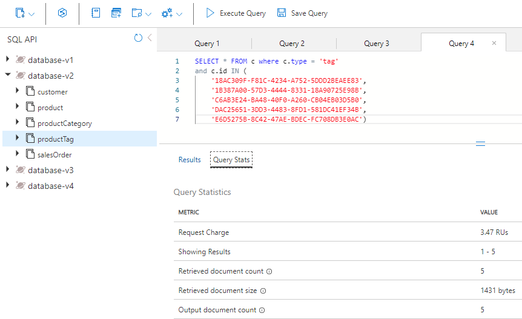
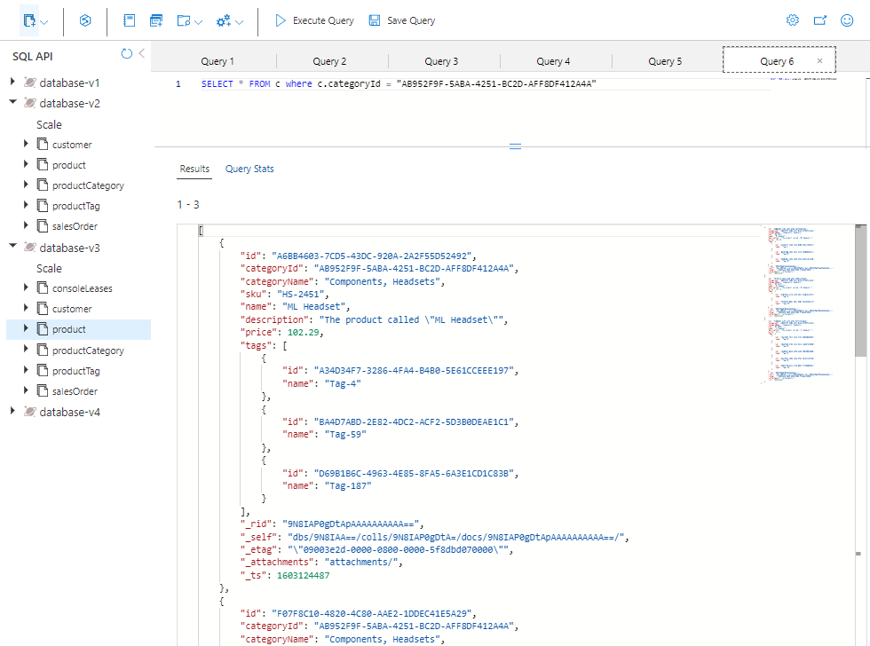

---
lab:
  title: データと集計を非正規化のコストと、参照整合性のための変更フィードの使用
  module: Module 8 - Implement a data modeling and partitioning strategy for Azure Cosmos DB for NoSQL
---

# データと集計を非正規化のコストと、参照整合性のための変更フィードの使用

リレーショナル モデルを使用すると、異なるエンティティを独自のコンテナーに配置できます。  ただし、NoSQL データベースではコンテナー間に*結合*はないので、*結合*の使用を排除するためにデータの非正規化を開始する必要があります。 さらに、NoSQL では、アプリケーションが可能な限り少ない要求でデータをフェッチできるようにデータをモデル化することで、要求の数を減らします。 データを非正規化すると発生する 1 つの問題は、エンティティ間の参照整合性である可能性があります。これには、変更フィードを使用してデータの同期を維持できます。また、カウントでグループ化のような集計を非正規化するのも、要求を減らすのに役立ちます。  

このラボでは、データと集計を非正規化はコスト削減にどのように役立つか、また、変更フィードを使用して非正規化されたデータの参照整合性を維持する方法の利点について説明します。

## 開発環境を準備する

このラボで作業している環境に **DP-420** のラボ コードのリポジトリをまだクローンしていない場合は、次の手順に従ってクローンします。 それ以外の場合は、以前にクローンしたフォルダーを **Visual Studio Code** で開きます。

1. **Visual Studio Code** を起動します。

    > &#128221; Visual Studio Code インターフェイスについてまだよく理解していない場合は、[Visual Studio Code の入門ガイド][code.visualstudio.com/docs/getstarted]を参照してください

1. コマンド パレットを開き、**Git: Clone** を実行して、任意のローカル フォルダーに ``https://github.com/microsoftlearning/dp-420-cosmos-db-dev`` GitHub リポジトリをクローンします。

    > &#128161; **Ctrl + Shift + P** キーボード ショートカットを使用してコマンド パレットを開くことができます。

1. リポジトリが複製されたら、**Visual Studio Code** で選択したローカル フォルダーを開きます。

1. **Visual Studio Code** の **[エクスプローラー]** ペインで、**17-denormalize** フォルダーを参照します。

1. **17-denormalize** フォルダーのコンテキスト メニューを開き、**[統合ターミナルで開く]** を選択して新しいターミナル インスタンスを開きます。

1. ターミナルが **Windows Powershell** ターミナルとして開く場合は、新しい **Git Bash** ターミナルを開きます。

    > &#128161; **Git Bash** ターミナルを開くには、ターミナル メニューの右側で、**+** 記号の横にあるプルダウンをクリックし、*Git Bash* を選択します。

1. **Git Bash ターミナル**で、次のコマンドを実行します。 コマンドを実行すると、ブラウザー ウィンドウが開き、指定されたラボ資格情報を使用する Azure portal に接続し、新しい Azure Cosmos DB アカウントを作成するスクリプトを実行した後、データベースにデータを入力して演習を完了するために使用するアプリをビルドして起動します。 提供された Azure アカウントの資格情報を入力すると、ビルドが完了するまでに 15 から 20 分かかることがあるため、コーヒーやお茶を飲むのにいいかもしれません。**

    ```
    "C:\Program Files (x86)\Microsoft SDKs\Azure\CLI2\python.exe" -m pip install pip-system-certs
    az login
    cd 17-denormalize
    bash init.sh
    dotnet add package Microsoft.Azure.Cosmos --version 3.22.1
    dotnet build
    dotnet run --load-data

    ```

1. 統合ターミナルを閉じます。

## 演習 1: データを非正規化するときのパフォーマンス コストを測定する

### 製品カテゴリ名のクエリを実行する

個々のコンテナーにデータが格納されている **database-v2** コンテナーでクエリを実行して、製品カテゴリ名を取得し、そのクエリの要求使用量を表示します。

1. 新しい Web ブラウザー ウィンドウまたはタブで、Azure portal (``portal.azure.com``) に移動します。

1. ご利用のサブスクリプションに関連付けられている Microsoft 資格情報を使用して、ポータルにサインインします。

1. 左側のペインで、**[Azure Cosmos DB]** を選択します。
1. 名前が **cosmicworks** で始まる Azure Cosmos DB アカウントを選択します。
1. 左側のペインで、**[データ エクスプローラー]** を選択します。
1. **[database-v2]** を展開します。
1. **productCategory** コンテナーを選択します。
1. ページの上部にある **[新しい SQL クエリ]** を選択します。
1. **[クエリ 1]** ペインに次の SQL コードを貼り付け、**[クエリの実行]** を選択します。

    ```
    SELECT * FROM c where c.type = 'category' and c.id = "AB952F9F-5ABA-4251-BC2D-AFF8DF412A4A"
    ```

1. **[結果]** タブを選択して結果を確認します。 このクエリからは、製品カテゴリの名前 "Component, Headsets" が返されることがわかります。

    

1. **[Query Stats] (クエリ統計)** タブを選択し、2.8 RU (要求ユニット) の要求使用量を確認します。

    

### カテゴリ内の製品のクエリを実行する

次に、製品コンテナーのクエリを実行して、"Components, Headsets" カテゴリのすべての製品を取得します。

1. **product** コンテナーを選択します。
1. ページの上部にある **[新しい SQL クエリ]** を選択します。
1. **[クエリ 2]** ペインに次の SQL コードを貼り付け、**[クエリの実行]** を選択します。

    ```
    SELECT * FROM c where c.categoryId = "AB952F9F-5ABA-4251-BC2D-AFF8DF412A4A"
    ```

1. **[結果]** タブを選択して結果を確認します。 HL Headset、LL Headset、ML Headset という 3 つの製品が返されることがわかります。 各製品には、SKU、名前、価格、製品タグの配列があります。

1. **[Query Stats] (クエリ統計)** タブを選択し、2.89 RU の要求使用量を確認します。

    

### 各製品のタグのクエリを実行する

次に、3 つの各製品 HL Headset、LL Headset、ML Headset について 1 回ずつ、productTag コンテナーのクエリを 3 回実行します。

#### HL Headset のタグ

最初に、クエリを実行して HL Headset のタグを取得します。

1. **productTag** コンテナーを選択します。
1. ページの上部にある **[新しい SQL クエリ]** を選択します。
1. **[クエリ 3]** ペインに次の SQL コードを貼り付け、**[クエリの実行]** を選択します。

    ```
    SELECT * FROM c where c.type = 'tag' and c.id IN ('87BC6842-2CCA-4CD3-994C-33AB101455F4', 'F07885AF-BD6C-4B71-88B1-F04295992176')
    ```

    このクエリからは、HL Headset 製品の 2 つのタグが返されます。

1. **[Query Stats]\(クエリ統計\)** タブを選択し、3.06 RU の要求使用量を確認します。

    

#### LL Headset のタグ

次に、クエリを実行して LL Headset のタグを取得します。

1. **productTag** コンテナーを選択します。
1. ページの上部にある **[新しい SQL クエリ]** を選択します。
1. **[クエリ 4]** ペインに次の SQL コードを貼り付け、**[クエリの実行]** を選択します。

    ```
    SELECT * FROM c where c.type = 'tag' and c.id IN ('18AC309F-F81C-4234-A752-5DDD2BEAEE83', '1B387A00-57D3-4444-8331-18A90725E98B', 'C6AB3E24-BA48-40F0-A260-CB04EB03D5B0', 'DAC25651-3DD3-4483-8FD1-581DC41EF34B', 'E6D5275B-8C42-47AE-BDEC-FC708DB3E0AC')
    ```

    このクエリからは、LL Headset 製品の 5 つのタグが返されます。

1. **[Query Stats] (クエリ統計)** タブを選択し、3.45 RU の要求使用量を確認します。

    

#### ML Headset のタグ

最後に、クエリを実行して ML Headset のタグを取得します。

1. **productTag** コンテナーを選択します。
1. ページの上部にある **[新しい SQL クエリ]** を選択します。
1. **[クエリ 5]** ペインに次の SQL コードを貼り付け、**[クエリの実行]** を選択します。

    ```
    SELECT * FROM c where c.type = 'tag' and c.id IN ('A34D34F7-3286-4FA4-B4B0-5E61CCEEE197', 'BA4D7ABD-2E82-4DC2-ACF2-5D3B0DEAE1C1', 'D69B1B6C-4963-4E85-8FA5-6A3E1CD1C83B')
    ```

    このクエリからは、ML Headset 製品の 3 つのタグが返されます。

1. **[Query Stats] (クエリ統計)** タブを選択し、3.19 RU の要求使用量を確認します。

    

### RU 使用量を合計する

次に、実行した各クエリのすべての RU コストを合計しましょう。

|**クエリ**|**RU/s コスト**|
|---------|---------|
|カテゴリ名|2.8|
|Product|2.89|
|HL 製品タグ|3.06|
|LL 製品タグ|3.45|
|ML 製品タグ|3.19|
|**RU コストの合計**|**15.39**|

### NoSQL の設計に対して同じクエリを実行する

非正規化されたデータベースで、同じ情報のクエリを実行しましょう。

1. Data Explorer で **database-v3** を選択します。
1. **product** コンテナーを選択します。
1. ページの上部にある **[新しい SQL クエリ]** を選択します。
1. **[クエリ 6]** ペインに次の SQL コードを貼り付け、**[クエリの実行]** を選択します。

    ```
   SELECT * FROM c where c.categoryId = "AB952F9F-5ABA-4251-BC2D-AFF8DF412A4A"
   ```

    結果は次のようになります。

    

1. このクエリで返されたデータを確認します。 それには、3 つの各製品のカテゴリ名とタグ名など、このカテゴリの製品を表示するために必要なすべての情報が含まれています。

1. **[Query Stats] (クエリ統計)** タブを選択し、2.89 RU の要求使用量を確認します。

### 2 つのモデルのパフォーマンスを比較する

データが個々のコンテナーに格納されるリレーショナル モデルでは、カテゴリの名前、そのカテゴリのすべての製品、および各製品のすべての製品タグを取得するために、5 つのクエリを実行しました。 5 つのクエリの要求使用量は合計で 15.56 RU でした。

NoSQL モデルで同じ情報を取得するために 1 つのクエリを実行し、要求使用量は 2.9 でした。

利点は、このモデルのような NoSQL 設計の低コスト化だけではありません。 この種の設計は、必要な要求が 1 つだけなので、より高速でもあります。 さらに、データ自体は Web ページにレンダリングするために適した方法で提供されます。 これは、eコマース アプリケーションでダウンストリームを記述して管理するためのコードが少ないことを意味します。

データを非正規化すると、eコマース アプリケーションで生成するクエリが、よりシンプルで効率的になります。 アプリケーションに必要なすべてのデータを 1 つのコンテナーに格納し、1 つのクエリでそれをフェッチすることができます。 この種のデータ モデリングを使用すると、高コンカレンシーのクエリを処理するときの簡単さ、速度、コストに関して大きなメリットがある可能性があります。

---

## 演習 2: 変更フィードを使用して参照整合性を管理する

このユニットでは、変更フィードを使用して、Azure Cosmos DB の 2 つのコンテナー間の参照整合性を維持する方法について説明します。 このシナリオでは、変更フィードを使用して productCategory コンテナーをリッスンします。 製品カテゴリの名前を更新すると、更新された名前が変更フィードによってキャプチャされ、そのカテゴリ内のすべての製品が新しい名前で更新されます。

この演習では、次の手順を行います。

- 理解すべき重要な概念がよくわかる、いくつかの C# コードを完成させます。
- 変更フィード プロセッサを開始して、productCategory コンテナーのリッスンを開始します。
- 製品コンテナーで、名前を変更するカテゴリと、そのカテゴリ内の製品の数のクエリを実行します。
- カテゴリ名を更新し、変更フィードによって変更が製品コンテナーに反映されるのを監視します。
- 新しい製品コンテナーで新しいカテゴリ名のクエリを実行し、製品の数をカウントして、すべてが更新されたことを確認します。
- 名前を元に戻し、変更フィードによって変更が反映されるのを確認します。

### Azure Cloud Shell を開始し、Visual Studio Code を開きます。

変更フィード用に更新するコードに移動するために、以下を実行します。

1. まだ開いていない場合は、Visual Studio Code を開き、*17-denormalize* フォルダーの *Program.cs* ファイルを開きます。

### 変更フィードのコードを完成させる

デリゲートに渡された変更を処理し、そのカテゴリの各製品をループ処理して更新するコードを追加します。

1. 変更フィード プロセッサを開始する関数に移動します。

1. Ctrl + G キーを押し、「**603**」と入力して、ファイル内のその行に移動します。

1. 次のコードが表示されます。

    

   588 と 589 行目には 2 つのコンテナー参照があります。 それらを正しいコンテナー名に更新する必要があります。 変更フィードは、コンテナー参照に変更フィード プロセッサのインスタンスを作成することで機能します。 この例では、productCategory コンテナーへの変更を監視しています。

1. 588 行目にある **{container to watch}** を `productCategory` に置き換えます。

1. 589 行目にある **{container to update}** を `product` に置き換えます。 製品カテゴリ名が更新されたら、そのカテゴリ内のすべての製品を新しい製品カテゴリ名で更新する必要があります。

1. *container to watch* と *container to update* の行の下にある *leaseContainer* の行を確認します。 leaseContainer は、コンテナーに対するチェック ポイントのように機能します。 変更フィード プロセッサによって最後にチェックされた後で更新されたものに関する情報が保持されています。
  
   変更フィードによって新しい変更が検出されるとデリゲートが呼び出され、読み取り専用のコレクションに変更が渡されます。

1. 処理する必要がある新しい変更が変更フィードにある場合に呼び出されるコードを 603 行目に追加する必要があります。 そのためには、次のコード スニペットをコピーし、**//To-Do:** で始まる行の下に貼り付けます

    ```
    //Fetch each change to productCategory container
    foreach (ProductCategory item in input)
    {
        string categoryId = item.id;
        string categoryName = item.name;
    
        tasks.Add(UpdateProductCategoryName(productContainer, categoryId, categoryName));
    }
    ```

1. これでコードは次の画像のようになります。

    

    既定では、変更フィードは 1 秒ごとに実行されます。 監視対象のコンテナーで多くの挿入や更新が行われるシナリオでは、デリゲートに複数の変更がある可能性があります。 そのため、デリゲート **input** を **IReadOnlyCollection** として入力します。

    このコード スニペットにより、デリゲート **input** のすべての変更がループ処理され、それらが **categoryId** と **categoryName** の文字列として保存されます。 その後、新しいカテゴリ名で製品コンテナーを更新する別の関数を呼び出すタスクが、タスク リストに追加されます。

1. Ctrl + G キーを押し、「**647**」と入力して **UpdateProductCategoryName()** 関数を探します。 ここでは、変更フィードによってキャプチャされた新しいカテゴリ名で製品コンテナー内の各製品を更新するコードを記述します。

1. 次のコード スニペットをコピーし、**//To-Do:** で始まる行の下に貼り付けます。 この関数では 2 つのことが行われます。 最初に、製品コンテナーに対して、**categoryId** で渡されたすべての製品のクエリが実行されます。 次に、各製品が新しい製品カテゴリ名で更新されます。

    ```
    //Loop through all products
    foreach (Product product in response)
    {
        productCount++;
        //update category name for product
        product.categoryName = categoryName;
    
        //write the update back to product container
        await productContainer.ReplaceItemAsync(
            partitionKey: new PartitionKey(categoryId),
            id: product.id,
            item: product);
    }
    ```

    コードは次のようになっているはずです。

    

    このコードにより、クエリの応答オブジェクトから行が読み取られた後、クエリによって返されたすべての製品で製品コンテナーが更新されます。

    ここでは、**foreach()** ループを使用して、クエリによって返された各製品を処理しています。 行ごとにカウンターを更新し、更新された製品の数を確認します。 その後、製品のカテゴリ名を新しい **categoryName** に変更します。 最後に、**ReplaceItemAsync()** を呼び出して、製品コンテナー内の製品を更新します。

1. Ctrl + S キーを押して、変更内容を保存します。

1. まだ開いていない場合は、Git Bash 統合ターミナルを開き、*17-denormalize* フォルダーの下にいることを確認します。

1. プロジェクトをコンパイルして実行するには、次のコマンドを実行します。

    ```
    dotnet build
    dotnet run
    ```

1. 画面にアプリケーションのメイン メニューが表示されます。

    

### 変更フィードのサンプルを実行する

変更フィードのコードが完成したので、その動作を見てみましょう。

1. メイン メニューで「**a**」と入力し、変更フィード プロセッサを起動します。 画面に進行状況が表示されます。

    

1. 任意のキーを押して、メイン メニューに戻ります。

1. メイン メニューで「**b**」と入力し、製品カテゴリ名を更新します。 次のシーケンスが実行されます。

    a. 製品コンテナーで "Accessories, Tires, and Tubes" カテゴリのクエリが実行され、そのカテゴリの製品の数がカウントされます。  
    b. そのカテゴリ名が更新され、"and" という単語がアンパサンド (&) に置き換えられます。  
    c. 変更フィードによってその変更が取得され、作成したコードを使用して、そのカテゴリのすべての製品が更新されます。  
    d. 変更フィードにより、名前の変更が元に戻され、カテゴリ名が元のものに変更されて、名前の "&" が元の "and" に置き換えられます。  
    e. 変更フィードによってその変更が取得され、すべての製品が元の製品カテゴリ名に更新されます。

1. メイン メニューで「**b**」と入力し、2 回目の変更フィードが実行されるまでプロンプトに従い、その後はそのままにします。 結果は次のようになります。

    

1. クリックの回数が多すぎてメイン メニューに戻ってしまった場合は、もう一度「**b**」と入力して、変更内容を確認します。

1. 終わったら、「**x**」と入力して終了し、Cloud Shell に戻ります。

---

## 演習 3: 集計の非正規化

このユニットでは、集計を非正規化して、eコマース サイトの上位 10 件の顧客クエリを作成する方法について説明します。 Azure Cosmos DB .NET SDK のトランザクション バッチ機能を使用して、新しい販売注文の挿入と、顧客の **salesOrderCount** プロパティの更新を同時に行います。これらはどちらも同じ論理パーティションに存在します。

この演習では、次の手順を行います。

- 新しい販売注文を作成するコードを表示します。
- 顧客の *salesOrderCount* をインクリメントするように、C# コードを更新します。
- "*トランザクション バッチ*" を使用して、新しい販売注文を挿入して顧客レコードを更新するトランザクションを実装するように C# コードを更新します。
- 特定の顧客のクエリを実行して、顧客レコードとその顧客の全注文を表示します。
- その顧客の新しい販売注文を作成し、**salesOrderCount** プロパティを更新します。
- 上位 10 件の顧客クエリを実行して、現在の結果を確認します。
- 顧客が注文を取り消したときのトランザクション バッチの使用方法を確認します。

## Visual Studio Code を開きます

このユニットで使用するコードを取得するには、以下を実行します。

1. まだ開いていない場合は、Visual Studio Code を開き、*17-denormalize* フォルダーの *Program.cs* ファイルを開きます。

## 合計販売注文を更新するコードを完成させる

1. 新しい販売注文を作成する関数に移動します。

1. Ctrl + G キーを押し、「**483**」と入力して、ファイル内のその行に移動します。

1. 次のコードが表示されます。

    

    この関数により、トランザクション バッチを使用して、新しい販売注文が作成され、顧客レコードが更新されます。

    最初に、**ReadItemAsync()** を呼び出し、パーティション キーと ID の両方として **customerId** を渡すことにより、顧客レコードを取得します。

1. 483 行目の **//To-Do:** コメントの下に、次のコード スニペットを貼り付けて **salesOrderCount** の値をインクリメントします。

    ```
    //Increment the salesOrderTotal property
    customer.salesOrderCount++;
    ```

    画面はこちらのようになるはずです。

    

## トランザクション バッチを実装するコードを完成させる

1. 数行下にスクロールして、顧客に作成する新しい販売注文のデータを表示します。

    新しい販売注文オブジェクトには、eコマース アプリケーションの販売注文に典型的なヘッダーと詳細情報の構造があります。

    販売注文ヘッダーには、**orderId**、**customerId**、**orderDate**、**shipDate** があります。これらは空白のままにします。

    顧客コンテナーには顧客と販売注文の両方のエンティティが含まれているため、販売注文オブジェクトにも、値が **salesOrder** である識別子プロパティ **type** が含まれています。 これにより、顧客コンテナー内の顧客オブジェクトと販売注文を区別することができます。

    さらに下には、販売注文の詳細セクションを構成する注文の 2 つの製品も表示されます。

1. もう 1 つの **//To-Do:** コメントまで、もう少しスクロールします。 ここには、トランザクション バッチを使用して新しい販売注文を挿入し、顧客レコードを更新するコードを追加する必要があります。

1. 次のコード スニペットをコピーし、**//To-Do:** コメントの下の行に貼り付けます。

    ```
    TransactionalBatchResponse txBatchResponse = await container.CreateTransactionalBatch(
        new PartitionKey(salesOrder.customerId))
        .CreateItem<SalesOrder>(salesOrder)
        .ReplaceItem<CustomerV4>(customer.id, customer)
        .ExecuteAsync();
    
    if (txBatchResponse.IsSuccessStatusCode)
        Console.WriteLine("Order created successfully");
    ```

    このコードでは、コンテナー オブジェクトで **CreateTransactionalBatch()** を呼び出します。 すべてのトランザクションは 1 つの論理パーティションにスコープされるので、それは必須パラメーターとしてパーティション キーの値を受け取ります。 また、新しい販売注文を **CreateItem()** の呼び出しに渡し、更新された顧客オブジェクトを **ReplaceItem()** の呼び出しに渡します。 次に、**ExecuteAsync()** を呼び出してトランザクションを実行します。

    最後に、応答オブジェクトを調べて、トランザクションが成功したかどうかを確認します。

    画面は次のようになります。

    

1. Ctrl + S キーを押して、変更内容を保存します。

1. まだ開いていない場合は、Git Bash 統合ターミナルを開き、*17-denormalize* フォルダーの下にいることを確認します。

1. プロジェクトをコンパイルして実行するには、次のコマンドを実行します。

    ```
    dotnet build
    dotnet run
    ```

1. 次に示すように、画面にアプリケーションのメイン メニューが表示されます。

    

## 顧客とその販売注文のクエリを実行する

パーティション キーとして **customerId** を使用して、顧客とそのすべての販売注文を同じコンテナーに格納するようにデータベースを設計したため、顧客コンテナーのクエリを実行することにより、顧客レコードとその顧客の販売注文のすべてを 1 回の操作で取得できます。

1. メイン メニューで「**c**」と入力し、**[Query for customer and all orders](顧客とすべての注文のクエリ)** のメニュー項目を実行します。 このクエリからは、顧客レコードが返された後、その顧客のすべての販売注文が返されます。 顧客のすべての販売注文の出力が画面に表示されます。

   最後の注文は **Road-650 Red, 58** の $782.99 であったことに注意してください。

1. **[Print out customer record and all their orders](顧客レコードとそのすべての注文を出力する)** まで上にスクロールします。

   **salesOrderCount** プロパティでは 2 つの販売注文が表示されることに注意してください。

   画面は次のようになります。

    

## トランザクションで新しい販売注文を作成して販売注文の合計を更新する

同じ顧客に対して新しい販売注文を作成し、顧客レコードに保存されている販売注文の合計を更新します。

1. ウィンドウで任意のキーを押して、メイン メニューに戻ります。
1. 「**d**」と入力し、**[新しい注文の作成と注文合計の更新]** のメニュー項目を実行します。
1. 任意のキーを押して、メイン メニューに戻ります。
1. 「**c**」と入力し、同じクエリを再実行します。

   新しい販売注文に **HL Mountain Frame - Black, 38** と **Racing Socks, M** が表示されていることに注意してください。

1. **[Print out customer record and all their orders](顧客レコードとそのすべての注文を出力する)** まで上にスクロールします。

   **salesOrderCount** プロパティでは 3 つの販売注文が表示されることに注意してください。

1. 画面は次のようになります。

    

## トランザクション バッチを使用して注文を削除する

他の eコマース アプリケーションと同様に、顧客は注文をキャンセルすることもあります。 ここでも同じようにできます。

1. 任意のキーを押して、メイン メニューに戻ります。

1. 「**f**」と入力し、**[注文の削除と注文合計の更新]** のメニュー項目を実行します。

1. 任意のキーを押して、メイン メニューに戻ります。
1. 「**c**」と入力して同じクエリを再実行し、顧客レコードが更新されたことを確認します。

   新しい注文が返されなくなったことに注意してください。 上にスクロールすると、**salesOrderCount** の値が **2** に戻ったことがわかります。

1. 任意のキーを押して、メイン メニューに戻ります。

## 販売注文を削除するコードを表示する

販売注文の削除方法は、作成とまったく同じ方法です。 どちらの操作もトランザクションにラップされ、同じ論理パーティションで実行されます。 それを行うコードを見てみましょう。

1. 「**x**」と入力してアプリケーションを終了します。
1. まだ開いていない場合は、Visual Studio Code を開き、*17-denormalize* フォルダーの *Program.cs* ファイルを開きます。

1. Ctrl + G キーを押し、「**529**」と入力します。

    この関数により、新しい販売注文が削除されて、顧客レコードが更新されます。

    ここでは、コードによってまず顧客レコードが取得され、次に **salesOrderCount** が 1 だけデクリメントされていることがわかります。

    次に、**CreateTransactionalBatch()** を呼び出します。 ここでも論理パーティション キーの値が渡されていますが、今度は、注文 ID で **DeleteItem()** が呼び出され、更新された顧客レコードで **ReplaceItem()** が呼び出されています。

## 上位 10 顧客クエリのコードを表示する

上位 10 顧客のクエリを見てみましょう。

1. Ctrl + G キーを押し、「**566**」と入力します。

    上部の近くに、クエリの定義があります。

    ```
    SELECT TOP 10 c.firstName, c.lastName, c.salesOrderCount
        FROM c WHERE c.type = 'customer'
        ORDER BY c.salesOrderCount DESC
    ```

    このクエリは、返されるレコードの数を制限する **TOP** ステートメントと、**salesOrderCount** プロパティに対する降順の **ORDER BY** による、非常に簡単なものです。

    また、顧客コンテナーには顧客と販売注文の両方が含まれているため、顧客だけが返されるように、**customer** 識別子プロパティの値が **type** になっていることにも注意してください。

1. アプリケーションがまだ実行されていない場合に再起動するには、次のコマンドを実行します。

    ```
    dotnet run
    ```

1. 最後に、「**e**」と入力してクエリを実行します。

    

    気付いていないかもしれませんが、上位 10 顧客クエリは、コンテナー内のすべてのパーティションを対象とするクロスパーティション クエリです。

    このラボに付随するラボでは、クロスパーティション クエリは回避する必要があると指摘されています。 ただし、実際には、このようなクエリは、コンテナーがまだ小さい場合やクエリの実行頻度が低い場合には問題ありません。 このクエリが頻繁に実行される場合、またはコンテナーが非常に大きい場合は、このデータを別のコンテナーに具体化し、それを使用してこのクエリを処理する場合のコストを調べてみることをお勧めします。

[code.visualstudio.com/docs/getstarted]: https://code.visualstudio.com/docs/getstarted/tips-and-tricks
